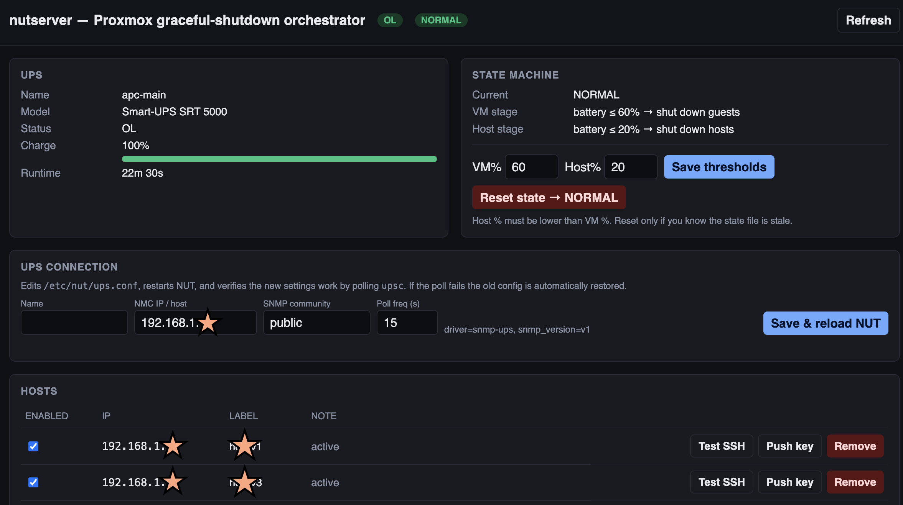

# nutshutdown

**UPS-triggered graceful shutdown for a Proxmox cluster, driven from a web UI.**

A small Flask app + cron worker that lives on an always-on host (Debian LXC,
small VM, Raspberry Pi — anything that can reach your UPS and your Proxmox
hosts). It watches the UPS over SNMP via [NUT][nut], and on an extended power
outage it gracefully shuts down VMs and LXCs across your Proxmox hosts via
SSH, then powers down the hosts themselves — in stages based on remaining
battery percentage. The web UI lets you add/remove hosts, edit thresholds,
change the UPS connection, push SSH keys, and dry-run the whole logic without
touching anything live.

[nut]: https://networkupstools.org/



> *(Replace `docs/screenshot.png` with a screenshot of your running web UI
> after install — see "Adding a screenshot" at the bottom.)*

> **No real-shutdown buttons in the UI on purpose.** Real shutdowns only fire
> from the cron worker reacting to actual UPS state. The UI exposes config
> edits, SSH connectivity tests, and a "simulate" button that prints what
> *would* happen at a chosen battery %.

## TL;DR install (Debian / Ubuntu / Proxmox LXC)

```sh
git clone https://github.com/<you>/nutshutdown.git
cd nutshutdown
sudo ./install.sh
```

Then follow the **6 numbered steps** the installer prints at the end (set up
NUT, edit `config.json`, generate an SSH key, start the web service, add your
Proxmox hosts via the UI). About 10 minutes total from clone to first shutdown
test.

Re-running `install.sh` upgrades the code in-place and never touches your
`config.json`.

## Requirements

- **A UPS with a network management card (NMC) that speaks SNMP.** This was
  built against an APC Smart-UPS SRT with the AP9641 NMC, but any SNMP-readable
  UPS that NUT's `snmp-ups` driver supports should work.
- **One always-on host on the same LAN as the UPS** to run the orchestrator.
  In our setup it's a 256MB Debian 12 LXC on Proxmox, but a small VM, a
  Raspberry Pi, or any Debian/Ubuntu box will do. **See [Topology](#topology)
  below — this should *not* be one of the Proxmox hosts you intend to shut
  down.**
- **One or more Proxmox VE hosts** to shut down. They need to be reachable
  over SSH from the orchestrator, with key-based root login (the UI helps you
  set that up).
- Python 3.9+, Flask, NUT 2.8+, `sshpass`. Apt packages: `nut nut-snmp
  python3-flask sshpass openssh-client`.

## Topology

**Don't run the orchestrator on a Proxmox host that's in its own shutdown
list.** If you did, the worker would issue a `shutdown -h now` to itself
mid-job and stop running before it could finish bringing the rest of the
fleet down.

The recommended pattern is a small "utility" machine that's separate from
your workload servers — a micro PC, an Intel NUC, a Raspberry Pi, or a
low-power Proxmox host dedicated to monitoring and orchestrators. The
workload (the servers you actually care about) lives on bigger boxes, and
*those* are what go in nutshutdown's host table.

A typical setup looks like this:

```
   ┌─────────────────────────────────────────────────────────────┐
   │  UPS (network-managed, e.g. APC Smart-UPS + AP9641 NMC)     │
   └────────────────────────────┬────────────────────────────────┘
                                │ SNMP
                                ▼
   ┌──────────────────────────────────────┐    ┌───────────────────────┐
   │  Small utility host (this stays up)  │    │  Workload Proxmox #1  │
   │   ├─ Proxmox VE (or plain Debian)    │    │   - VMs / LXCs that   │
   │   └─ nutshutdown LXC (the orchestr.) │───▶│     hold real work    │
   └──────────────────────────────────────┘ssh └───────────────────────┘
                          │
                          │ssh                  ┌───────────────────────┐
                          └────────────────────▶│  Workload Proxmox #2  │
                                                └───────────────────────┘
```

In the author's setup the "utility host" is a fanless micro PC running
Proxmox with a handful of small LXCs (this orchestrator, plus other monitoring
bits). The workload sits on a Dell and a Supermicro server — those two are
the only entries in nutshutdown's host table, and they're what the worker
gracefully powers down on a long outage.

The utility host itself is not covered by nutshutdown's graceful shutdown —
the UPS will eventually cut its power when the battery runs out, and that's
fine. The orchestrator's whole job is to make sure the *important* boxes
are already down well before then.

## How it works

```
   UPS network management card
            │  SNMP v1/v2c
            ▼
       NUT (upsd)  ── upsc <ups-name> ──┐
                                        ▼
                            power_monitor.py   ← cron, every minute
                                        │
                 ssh root@<host> "qm/pct shutdown" then "shutdown -h now"
                                        ▼
                       Proxmox hosts marked enabled in config.json
```

### Trigger logic

A single pure function (`pmlib.decide_action`) drives both the cron worker
and the "simulate" button. Given the UPS status, the battery %, and the
current state file value:

| UPS status | Battery charge | Action |
|---|---|---|
| `OL` (online) | any | If state ≠ NORMAL → reset to NORMAL ("Power Restored") |
| `OB` / `LB` (on battery) | > `vm_shutdown_pct` | noop (logged once on the OB → battery transition) |
| `OB` / `LB` | `host_pct < c ≤ vm_pct` | Shut down all guests on each enabled host; state → `GUESTS_DOWN` |
| `OB` / `LB` | ≤ `host_shutdown_pct` | `shutdown -h now` on each enabled host; state → `HOSTS_DOWN` |

Each stage runs **once** per outage (gated on `/var/run/power_state`) so the
1-minute cron doesn't spam shutdown requests.

Per-host commands fired over SSH (only against `enabled: true` hosts):

```sh
qm  list | grep running | awk '{print $1}' | xargs -r -I % qm  shutdown %
pct list | grep running | awk '{print $1}' | xargs -r -I % pct shutdown %
shutdown -h now
```

## Install

### What the installer does (and doesn't)

`install.sh` is intentionally small — it touches **only** things that are the
same on every install:

| Step | Automated by `install.sh`? |
|---|---|
| `apt install nut nut-snmp python3-flask sshpass …` | ✅ |
| Copy code → `/opt/nutshutdown/` | ✅ |
| Drop placeholder `config.json` (only if absent) | ✅ |
| Install systemd unit + `nut-driver` `TimeoutStopSec=10` drop-in | ✅ |
| Add the per-minute cron line | ✅ |
| Write `/etc/nut/*.conf` (UPS-specific — your IP, your community) | ❌ — you do this once, ~5 min |
| Generate an SSH key | ❌ — security decision is yours |
| Start the web UI | ❌ — start it *after* you've edited `config.json` |

That's it. No build step, no compilation, no Python virtualenv. Everything is
plain interpreted Python and a tiny amount of shell.

### Step by step (manual, if you don't trust scripts)

```sh
# 1) dependencies
sudo apt update
sudo apt install -y nut nut-snmp python3 python3-flask sshpass openssh-client

# 2) code
sudo mkdir -p /opt/nutshutdown
sudo cp pmlib.py power_monitor.py manage.py webapp.py /opt/nutshutdown/
sudo cp config.example.json /opt/nutshutdown/config.json
sudo chmod 0640 /opt/nutshutdown/config.json
sudo nano /opt/nutshutdown/config.json   # set web.password and host list

# 3) systemd web service + driver-stop drop-in
sudo cp examples/nutshutdown-web.service /etc/systemd/system/
sudo mkdir -p /etc/systemd/system/nut-driver@.service.d/
sudo cp examples/nut-driver-timeout.conf /etc/systemd/system/nut-driver@.service.d/override.conf
sudo systemctl daemon-reload

# 4) cron
(crontab -l 2>/dev/null; echo "* * * * * /usr/bin/python3 /opt/nutshutdown/power_monitor.py") | sudo crontab -

# 5) SSH key (used by the orchestrator to log into Proxmox hosts)
sudo ssh-keygen -t ed25519 -f /root/.ssh/id_ed25519 -N ""
sudo sed -i 's#/root/.ssh/id_rsa#/root/.ssh/id_ed25519#' /opt/nutshutdown/config.json
```

### NUT setup

NUT runs alongside the app. You need three small files, all in `/etc/nut/`.
Samples are in `examples/`:

| File | Sample | What to edit |
|---|---|---|
| `/etc/nut/nut.conf`  | `examples/nut.conf.sample`  | Probably nothing — just set `MODE=netserver` |
| `/etc/nut/ups.conf`  | `examples/ups.conf.sample`  | NMC IP, SNMP community, section name |
| `/etc/nut/upsd.conf` | `examples/upsd.conf.sample` | LISTEN line(s) — add this host's LAN IP |

Then:

```sh
sudo systemctl enable --now nut.target
upsc <your-ups-section-name>          # smoke test; should dump variables
```

The section name in `ups.conf` (e.g. `[ups-main]`) **must match** `ups_name`
in `config.json`. After that, future UPS edits (IP, community, poll freq,
name) can be done in the web UI — see "Editing the UPS connection" below.

### Push SSH keys to your Proxmox hosts

Either from the web UI (per-row "Push key" button → modal asks for the host's
root password, runs `ssh-copy-id` via `sshpass` server-side) or from a shell:

```sh
sudo ./manage.py push-key 10.0.0.21
sudo ./manage.py add 10.0.0.21 --label pve-01
sudo ./manage.py test-ssh 10.0.0.21
```

### Start the web UI

```sh
sudo systemctl enable --now nutshutdown-web.service
```

Browse to `http://<orchestrator-host>:8080`. Default credentials are in
`config.json` (`admin` / whatever you set). **Change them before exposing the
UI anywhere beyond a trusted LAN.**

## Using it

### The web UI

- **UPS panel** — live status pill, charge bar (warn/crit colors), runtime
  estimate, model.
- **State machine** — current state (`NORMAL` / `GUESTS_DOWN` / `HOSTS_DOWN`),
  threshold editor, "Reset state → NORMAL" button.
- **UPS connection** — name, NMC IP, SNMP community, poll frequency. Edits
  rewrite `/etc/nut/ups.conf`, restart NUT, and verify the new config works
  by polling `upsc`. If the verify fails the old config is automatically
  restored. (Driver and SNMP version stay file-only on purpose.)
- **Hosts table** — toggle enable/disable, per-row "Test SSH" + "Push key" +
  "Remove". Add-host row with optional one-shot key push.
- **Simulate** — enter a fake charge %, see exactly which action would fire
  and which SSH commands would be issued. Nothing is actually shut down.
- **Recent log** — tail of `/var/log/power_monitor.log`.

### CLI parity

Everything the web UI does is also available via `manage.py`:

| Task | Command |
|---|---|
| Show UPS + state + host summary | `./manage.py status` |
| List all hosts | `./manage.py list` |
| Add a host | `./manage.py add 10.0.0.21 --label pve-01` |
| Remove a host | `./manage.py remove 10.0.0.21` |
| Enable / disable | `./manage.py enable 10.0.0.21` / `disable 10.0.0.21` |
| Push SSH key (interactive) | `./manage.py push-key 10.0.0.21` |
| Verify SSH | `./manage.py test-ssh` (all) or `./manage.py test-ssh 10.0.0.21` |
| Change thresholds | `./manage.py set-threshold vm 55` / `set-threshold host 15` |
| Dry-run at fake charge | `./manage.py simulate 45` |
| Reset state file | `./manage.py reset-state` |
| Dry-run real worker | `DRY_RUN=1 /opt/nutshutdown/power_monitor.py` |

### Safety / what won't break things

- The web UI never triggers a real shutdown. Only the cron worker can — and
  only when the UPS itself reports `OB`/`LB` and the battery is below your
  threshold.
- Every shutdown stage is gated by `/var/run/power_state`, so the per-minute
  cron can't double-fire.
- `DRY_RUN=1` is a complete side-effect-free path through the worker — no
  SSH, no state writes. Safe to run any time.
- UPS-config edits are validate-and-rollback: a bad community or unreachable
  NMC triggers an automatic restore of the previous `ups.conf` and a NUT
  restart, so the form can't brick monitoring.

## Architecture

| File | Purpose |
|---|---|
| `config.json` | Single source of truth — UPS name, thresholds, hosts, SSH, web auth |
| `pmlib.py` | Shared library — config IO, `upsc` wrapper, SSH runner, state machine, decision logic, UPS config writer with rollback |
| `power_monitor.py` | Cron worker. Reads config, decides action, runs it. Honors `DRY_RUN=1` |
| `manage.py` | CLI |
| `webapp.py` | Flask UI (single self-contained file with inline HTML/CSS/JS) |
| `examples/nutshutdown-web.service` | systemd unit for the web app |
| `examples/nut-driver-timeout.conf` | `TimeoutStopSec=10` drop-in for `nut-driver@.service` so a stuck SNMP driver can't hang web-driven UPS edits |
| `examples/ups.conf.sample` etc | NUT config templates |
| `examples/crontab.example` | Per-minute cron line |

### Web API

| Method | Path | Auth | Notes |
|---|---|---|---|
| GET    | `/api/status` | no | UPS + state + hosts + log tail |
| GET    | `/api/ups/config` | no | Current `ups.conf` section keys + `ups_name` |
| POST   | `/api/ups/config` | yes | `{name, host, community, pollfreq}` — write, restart NUT, verify, auto-rollback |
| POST   | `/api/simulate` | no | `{charge, on_battery}` — pure dry-run |
| POST   | `/api/test-ssh` | no | `{ip}` or empty for all |
| POST   | `/api/host/<ip>/push-key` | yes | `{password}` — `sshpass + ssh-copy-id`; password via env var, never logged |
| POST   | `/api/host` | yes | Add: `{ip, label, note, enabled}` |
| PATCH  | `/api/host/<ip>` | yes | `{enabled, label, note}` |
| DELETE | `/api/host/<ip>` | yes | |
| POST   | `/api/thresholds` | yes | `{vm_shutdown_pct, host_shutdown_pct}` |
| POST   | `/api/state/reset` | yes | Force state → `NORMAL` |

Mutating endpoints use HTTP Basic Auth against `web.username` / `web.password`
in `config.json`.

## Tuning

- **`vm_shutdown_pct` / `host_shutdown_pct`**: with my SRT 5000 and a modest
  load I see ~3 %/min drain on battery, so 60 → 20 gives ~13 minutes for
  guests to finish their normal Windows/Linux shutdown sequences before the
  hosts themselves go down. Tune to your runtime curve — `upsc <name>
  battery.runtime` gives the UPS's own estimate.
- **`pollfreq`** (in `ups.conf`): how often NUT asks the NMC for fresh data.
  15s is the default; lower = more responsive but more SNMP chatter, higher
  = less network traffic but slower reaction.
- **Brief grid blips** (a few seconds of `OB` then back to `OL`) will log
  "Power Failure Detected" but never trigger a shutdown because they don't
  drain the battery below the threshold. This is intentional.

## Limitations

- One UPS, one NUT section. If you have multiple UPSes you'd need to
  generalize `ups_name` to a list.
- SNMP v1/v2c only — v3 (auth/privacy) isn't exposed in the UI. Easy to add
  by editing `ups.conf` directly.
- No HTTPS in the bundled web app. Put it behind a reverse proxy (Caddy,
  nginx) if you need it.
- Targets Proxmox VE specifically (`qm` / `pct`). Easy to adapt to plain
  KVM/libvirt by editing the two shutdown commands in `pmlib.py`.

## Adding a screenshot

The README references `docs/screenshot.png`. To add yours:

1. Finish installing and start the web UI.
2. Open `http://<your-host>:8080` in a browser.
3. Take a screenshot of the whole page (macOS: ⌘⇧4 then Space; Windows: Win+Shift+S; Linux: any screenshot tool).
4. Save it as `docs/screenshot.png` in your local clone.
5. `git add docs/screenshot.png && git commit -m "Add UI screenshot" && git push`.

The image will appear automatically when GitHub renders the README.

## License

MIT — see [LICENSE](LICENSE).
